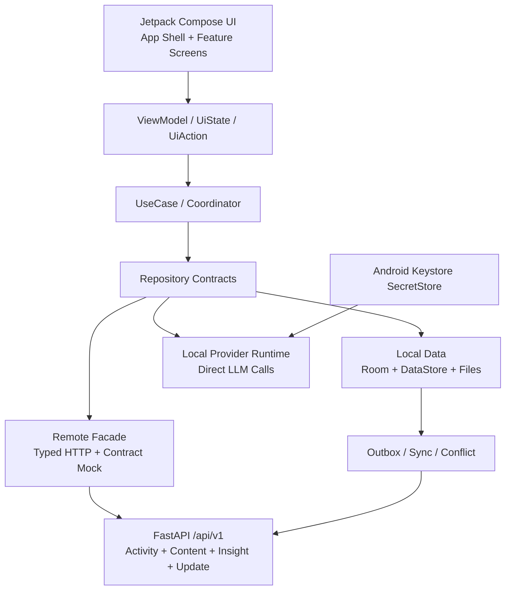

# Reverse Tutor 重构进度与总体设计报告

> 面试口径版，基于 `work/ui-design-system` 分支在 2026-07-14 的仓库、文档、测试报告与设备验证记录整理。

## 1. 一句话总结

Reverse Tutor 正在从“Python 后端 + 单文件 PWA + Capacitor APK”迁移为“原生 Android 主线 + 本地优先数据层 + 可选 FastAPI 在线增强”的三层混合架构。目前原生架构、核心数据契约、主要页面骨架、导入导出、图谱和资料基础能力已经落地并可构建演示，但尚未达到替换旧 APK 的发布门槛。

## 2. 项目定位

Reverse Tutor 是一款以“反向教学”为核心的学习产品。用户不是被动听 AI 讲课，而是向一个有角色、目标和认知状态的学习者讲解知识；系统通过追问、复述、质疑、纠错、记忆和知识图谱帮助用户暴露理解盲区。

本轮重构解决四类问题：

1. 旧 PWA 是约 441 KB 的单文件前端，UI、状态、LLM 调用和图谱逻辑高度耦合，长期维护成本高。
2. Capacitor 能快速交付 APK，但原生后台任务、通知、文件选择、进程恢复、系统返回和窄屏适配能力受限。
3. Python、PWA 和 Android 容易各自演化，必须用版本化协议和测试夹具控制行为漂移。
4. 学习内容、聊天正文、资料和 API Key 具有隐私属性，不能简单采用全量云同步。

## 3. 总体架构



核心依赖方向是：

```text
Compose Screen
  -> ViewModel / UiState / UiAction
  -> UseCase / Coordinator
  -> Repository interface
  -> Room / DataStore / SecretStore / Files / Python API
```

### 三条现存实现线

| 实现线 | 当前角色 | 未来定位 |
|---|---|---|
| Python 后端 | FastAPI、业务规则参考、在线能力、协议与回归基线 | 保留为在线服务和跨端参考实现 |
| PWA/Capacitor | 现有用户可用版本、迁移数据来源、行为参考 | Phase 6 通过且用户批准后退出 APK 发布链路 |
| Native Android | 当前产品主线 | 成为正式移动客户端 |

### 架构原则

- 本地优先：聊天、资料、图谱和世界树不依赖 Python 服务才能使用。
- 单向依赖：UI 不直接依赖 DAO、Room Entity、HTTP DTO 或 SecretStore。
- 实体分权：本地学习数据、服务端事实和允许同步的数据采用不同主权。
- 显式同步：默认不同步会话正文、消息、资料正文、图谱、世界树和密钥。
- 契约优先：Kotlin Domain、HTTP OpenAPI、Mock 和 Room Migration 同步演进。
- 迟到结果隔离：会话删除、重试或切换后，旧生成结果不能写回新会话。
- 安全隔离：API Key 只进入 Keystore 支持的 SecretStore，不进入普通表、日志、导出或同步。

## 4. 技术栈

### 原生 Android

| 类别 | 技术 |
|---|---|
| 语言与构建 | Kotlin 1.9.22、Java 17、Gradle 8.2.1、Android Gradle Plugin 8.2.1 |
| Android 基线 | compileSdk/targetSdk 34、minSdk 23、内部包名 `com.reversetutor.preview` |
| UI | Jetpack Compose、Material 3、Compose BOM 2024.02.00 |
| 状态与异步 | ViewModel 风格状态模型、Kotlin Coroutines 1.7.3 |
| 本地数据库 | Room 2.6.1，当前 Schema Version 4 |
| 轻量设置 | DataStore Preferences 1.0.0 |
| 后台任务 | WorkManager 2.9.0 |
| 密钥 | Android Keystore-backed SecretStore |
| 协议 | kotlinx.serialization 1.6.x、版本化 JSON Schema、OpenAPI V1 |
| 网络 | 类型化 Remote Facade，底层 `HttpURLConnection` Transport，可替换 Mock/HTTP 实现 |
| 测试 | JUnit 4、Compose UI Test、AndroidX Runner、Room Migration/Repository Instrumentation |

### Python 与旧客户端

| 类别 | 技术 |
|---|---|
| 在线与参考后端 | Python 3.11、FastAPI、Uvicorn、Pydantic、HTTPX |
| 数据 | SQLAlchemy 2.x，默认 SQLite，可通过 `DB_URL` 切换 |
| 检索与学习逻辑 | Hybrid Retriever、知识图谱抽取/检索、记忆与掌握度规则 |
| 旧移动端 | HTML/CSS/JavaScript 单文件 PWA、Capacitor 6 |
| Python 测试 | Pytest、异步测试、网络与 LLM 强制 Mock |

### 模块化结果

当前原生工程包含 11 个 Gradle 模块：

```text
:app
:core:model       :core:domain      :core:protocol
:core:data        :core:llm         :core:remote
:feature:chat     :feature:memory   :feature:sources   :feature:settings
```

仓库当前统计为 215 个 Kotlin 文件，其中主代码 135 个、测试 80 个；Room 已有 34 个实体，覆盖会话、消息、模型连接、生成任务、记忆、图谱、资料、同步、世界树和迁移审计等领域。

## 5. 核心设计场景

### 场景一：反向教学主循环

用户选择学习模板或自定义“世界树”，创建学习者角色、目标、学习范围、剧情、资料和复盘规则。用户在聊天中负责讲解，系统中的学习者负责追问、复述和质疑。消息先本地持久化，再创建独立 TurnRun；模型切换不会改变已发送任务的模型快照。

### 场景二：并发聊天与后台回复

每条消息对应独立生成任务，支持 queued、running、completed、failed、cancelled 和 discarded 状态。消息在生成开始后继续发送时进入下一轮队列；会话被删除或任务重试后，旧 attempt 的迟到结果会被 token/session 校验丢弃。WorkManager 负责进程恢复和后台执行基础。

### 场景三：世界树会话配置

世界树不是简单的角色和目标表单，而是可保存草稿的结构化会话配置。V1 支持学生角色、学习目标、学习计划、画像系统、三幕剧情、资料库和自定义栏目。Room V4 使用三张表保存草稿、栏目和资料关联，复合写入使用事务，信息不完整时也允许保存和预览。

### 场景四：学习大脑与知识图谱

系统把笔记、锚点、错误、Memory、图谱节点和资料证据组织为 Context Hub。图谱采用原生 Compose Canvas，支持平移、缩放、节点选择、详情、审核和会话/全局作用域，不使用 WebView 复用旧 Canvas。

### 场景五：资料与多模态输入

通过 Android 系统 Picker 获取 URI。TXT/Markdown 支持本地解析，HTML 支持受限清洗解析；PDF、DOCX、PPTX、EPUB 和图片使用明确的 partial/future-assisted/unsupported 状态，不把“只保存元数据”伪装为“已完成解析”。资料片段可以进入受限的聊天上下文，图片输入受模型视觉能力控制。

### 场景六：旧用户迁移

旧 PWA 负责导出，Native 支持 append、overwrite 和 new-space 三种导入模式，并提供 dry-run、错误摘要、导入批次审计和破坏性确认。导出默认排除密钥；首次启动导入提示只在正式替换构建中开启。

### 场景七：离线、本地与在线增强

本地会话、消息、世界树、资料和图谱在无网络时仍可使用。公益内容、挑战活动、排行榜、周报增强和版本信息通过 FastAPI `/api/v1` 接入；Remote Facade 可以在真实 HTTP、契约 Mock 和 local-only 模式间切换，而 Compose 页面不需要变化。

### 场景八：同步与冲突

V1 只允许活动进度、学习计划、同步摘要和部分设置进入同步白名单。Sync 使用 `envelopeId + entityId + revision + idempotencyKey`；单项失败不阻塞批次。文本冲突生成明确的 SyncConflict，由用户选择本地或远端版本，不做静默覆盖。

## 6. UI 与交互设计

### 信息架构

- 会话：首页工作台，承载公益内容、已加入挑战、置顶会话和普通会话。
- 聊天：消息时间线、引用、附件、生成状态、停止/重试和会话设置。
- 学习大脑：全局图谱、薄弱节点、Memory、笔记、锚点和错误。
- 资料：资料库、解析状态、片段、重处理和附件入口。
- 社区：当前为视觉与导航占位，业务 API 尚未冻结。
- 设置：模型连接、导入导出、外观、诊断、更新和数据擦除。

### 视觉与适配

- 当前 Compose Token 使用冷灰背景、近白表面、紫蓝主色、琥珀辅助色和薄荷状态色。
- 目标宽度为 360-430dp，Figma 基准画板为 390x884，最小触控区为 44x44dp。
- 支持浅色/深色语义色、稳定组件尺寸、IME/系统栏安全区和系统字体。
- 动效控制在 120/180/280ms 三档，强调可打断和状态表达。
- 华为 HMA-AL00 已完成 360dp 和约 423dp 两档真机适配；长列表 518 帧测试记录为 0 jank。

### 状态设计

所有主要页面都要求覆盖 loading、content、empty、offline、retryable error、contract error、permission error 和 disabled reason。未实现能力必须明确禁用或显示真实状态，不用 UI 文案掩盖后端缺口。

## 7. 当前重构进度

| 工作流 | 当前状态 | 已有结果 | 尚缺内容 |
|---|---|---|---|
| 产品/架构规划 | 已完成 | PRD、ARCH、TODO、模块边界、数据主权和发布门禁 | 持续维护文档与实现一致性 |
| Native 基础 | 已完成 | 11 模块、Compose Shell、导航、主题、Room/DataStore/SecretStore 基础 | 正式包名与替换发布流程尚未启用 |
| 核心聊天 | 主链路基础已完成 | 会话、消息、引用、附件草稿、模型配置、生成状态、迟到结果隔离 | 完整并发/通知/真实服务与设备矩阵仍需补齐 |
| Figma UI 重构 | 已验证 | 主要中文页面、共享组件、窄屏修复、Debug APK、真机关键流 | 6 条旧英文仪器测试需重写；Figma 自动逐节点复核需重新授权 |
| 导入导出 | 基础完成并有真机证据 | dry-run、三种导入模式、导出、擦除和首次启动提示 | Phase 6 真实旧备份样本与完整设备矩阵 |
| Memory/Graph/Sources | 功能骨架完成 | 原生图谱、记忆仓库、资料库、简单解析、上下文注入 | 精确引用跳转、复杂格式本地解析、完整图谱语义与验收 |
| 后台可靠性 | 部分完成 | WorkManager 任务、恢复/取消/丢弃、会话删除保护 | 用户通知、通知设置、诊断闭环和全设备验证 |
| 在线契约 | V1 骨架完成 | OpenAPI、Mock、Typed Facade、Canonical Sync、错误策略 | 内容接口、活动鉴权/退出、真实后端全量联调；社区契约未冻结 |
| WorldTree | 数据层完成 | Domain、Codec、Room 三表、Repository、V3->V4 Migration | Compose 创建流程接真实 Repository；两条真机数据测试待补验 |
| PWA 退出 | 未满足门槛 | 迁移来源和行为参考仍可用 | Phase 6、P0 门禁、迁移文档、设备矩阵和用户明确批准 |

### 量化口径

- 旧版入口登记：44 项。
- 当前状态：4 项 verified、38 项 in_progress、2 项 not_started。
- P0 入口：31 项，其中 28 项仍是正式替换阻断项。
- 结论：功能覆盖面较广，但 release parity 仍未完成，不能宣称原生版已经完全替代旧版。

## 8. 当前验证证据

### 2026-07-14 本次实测

- `py -m pytest -q tests/test_server.py tests/test_db.py tests/test_mobile_persistence.py tests/test_update_check_resilience.py`
  - 结果：`101 passed`。
- `gradlew test lint :app:assembleDebug --no-daemon --stacktrace`
  - 结果：构建成功。
  - 当前测试 XML 汇总：504 tests、0 failures、0 errors、0 skipped。
- Debug APK 存在于 `mobile-native/app/build/outputs/apk/debug/app-debug.apk`。
- 当前没有连接 Android 设备，因此本次没有重新执行 instrumentation。

### 已有真机证据

- 设备：Huawei HMA-AL00，Android 10。
- 已验证首页、聊天、IME、新建/自定义会话、系统返回、导入导出、图谱和资料等关键流。
- 已通过当前 Figma 流程的 `FigmaResponsiveDeviceTest`。
- 全量历史 connected suite 中 6 条测试仍使用重构前英文选择器，当前会超时，需要作为测试维护任务迁移。
- `WorldTreeRepositoryInstrumentedTest` 与 `ReverseTutorDatabaseMigration3To4Test` 已编译，但尚缺设备执行记录。

### 工作树状态

当前分支是 `work/ui-design-system`。工作树仍有 69 个已跟踪修改文件和 55 个未跟踪项，包含 UI、在线 Facade、契约、测试和文档。因此当前成果适合作为集成分支和演示基线，但在正式评审前仍需拆分提交、复核归属并保持 PWA 与冻结 Core 改动边界清晰。

## 9. 主要风险与下一步

1. 发布门禁未完成：先关闭 28 个 P0 replacement blockers，再讨论替换旧 APK。
2. 测试债务：重写 6 条旧英文 instrumentation，并在设备可用时补跑 WorldTree 两条测试。
3. 在线联调：完成内容、活动鉴权、退出活动、标准错误和真实缓存/断网测试。
4. Phase 3：补齐通知、后台设置、诊断和恢复矩阵。
5. Phase 5：完成精确 citation、复杂资料解析、图谱证据跳转和真实会话投影。
6. Phase 6：执行完整旧入口审计、真实备份迁移、设备矩阵、正式包名/签名与迁移手册。
7. 设计治理：当前 Figma Token 与早期设计语言文档存在部分色彩和圆角差异，应冻结唯一视觉基线，避免文档漂移。
8. 版本治理：当前大工作树需要按 UI、在线契约、WorldTree/数据和旧 PWA 兼容拆分审查，避免把独立风险合并进一次提交。

## 10. 面试陈述参考

### 90 秒版本

我目前在做 Reverse Tutor 的移动端重构。它原来是 Python 后端加单文件 PWA，再通过 Capacitor 打成 APK，交付快，但前端状态、LLM 调用、图谱和持久化耦合比较严重。我的重构方向不是简单换成 Compose，而是建立原生 Android、本地业务和在线增强三层架构。

Android 侧使用 Kotlin、Jetpack Compose、Room、DataStore、WorkManager 和 Keystore。UI 只能通过 UseCase 和 Repository 使用能力，不能直接碰 DAO、HTTP DTO 或密钥。聊天、资料、知识图谱和世界树默认本地可用；Python FastAPI 只承接活动、公益内容、周报、更新和显式同步等在线能力。同步采用白名单和幂等 envelope，聊天正文、资料正文、图谱和 API Key 默认不上云。

目前已经完成 11 个 Gradle 模块、Room V4、主要中文页面、原生图谱、资料库、三种导入模式、生成任务隔离和在线 V1 Typed Facade。最新本地验证是 Python 101 个测试通过，Android 全模块 test、lint 和 Debug APK 构建通过；此前也在华为真机上做过 360dp/423dp、IME、返回链和长列表性能验证。项目还没有宣称替换旧 APK，因为 44 个旧入口中只有 4 个完成最终验证，仍有 28 个 P0 发布阻断项。下一阶段重点是通知与诊断、精确引用和复杂资料解析、在线真实联调，以及 Phase 6 的迁移和设备矩阵。

### 面试官可能追问

**为什么不继续维护 PWA？**

PWA 仍作为迁移和行为参考保留，但后台生成、通知、文件 URI、系统返回、进程恢复、原生图谱手势和安全密钥存储都更适合 Native。重构价值是可靠性、可维护性和系统能力，不只是视觉升级。

**为什么采用本地优先？**

学习对话和资料包含隐私，而且用户需要离线可用。先完成本地事务能降低网络耦合；只有明确白名单实体进入 Outbox，服务端失败不会回滚用户的本地学习行为。

**如何避免 Android、Python 和旧 PWA 行为漂移？**

不共享源码，而是共享版本化协议。OpenAPI、JSON Schema、Mock、Room Schema 和 contract test 一起演进；Android Decoder 会拒绝旧 `status` 形态的 Sync 响应，迫使不兼容变更显式暴露。

**最难的技术点是什么？**

一是生成任务的因果与迟到结果隔离，必须同时校验 session、turn、attempt 和 token；二是旧用户迁移，既要支持 append/overwrite/new-space，又不能泄漏密钥或破坏原数据；三是本地与在线数据主权的边界，不能把“支持同步”误解为“全量上云”。

**如何保证重构不是大爆炸？**

旧 PWA 保持可用，Native 按 Phase 0-6 和 44 项入口注册表推进；每个模块要求单测、契约测试、Lint、Debug 构建和必要的真机证据。只有全部 P0 项验证或明确豁免、迁移路径和设备矩阵完成后，才允许退出旧 APK。

## 11. 面试中的事实边界

可以说：

- 原生架构、模块和主要功能骨架已经落地。
- UI 重构已经通过构建、单测、Lint 和关键真机流。
- 本地优先、数据主权、同步白名单和密钥隔离已经形成明确设计与实现基础。
- 项目可以构建 Debug APK，并具备阶段性演示能力。

不要说：

- 原生版已经完全替代 PWA。
- 所有旧入口已经完成。
- 所有在线接口已经真实联调完成。
- PDF/DOCX/PPTX/EPUB 已全部完成本地解析。
- 全量 instrumentation 已经全绿。
- 社区后端契约已经定稿。
